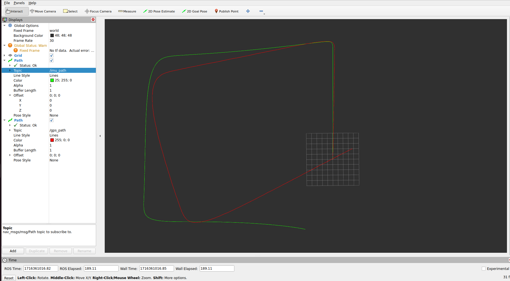
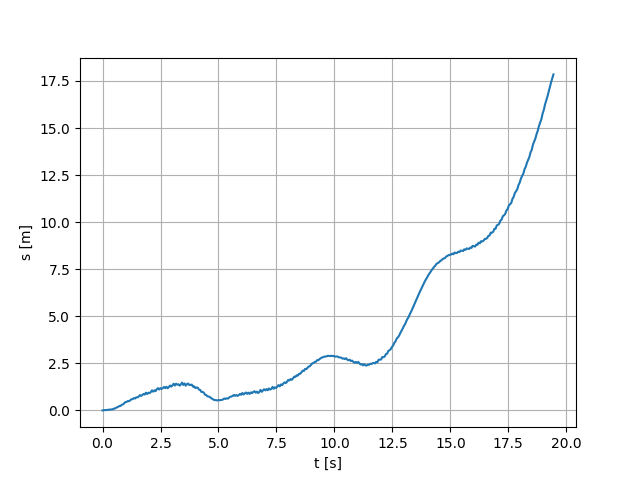

# Inercial Data Analysis

## Overview
This project is a trajectory estimation system. It includes program for estimation trajectory from IMU for real and simulated UAV.

## Project Structure

- `config.yaml`: Configuration file for the project settings.
- `README.md`: This file containing the project description.
- `requirements.txt`: Lists the dependencies required to run the project.
- `save_to_file_mavsdk.py`: Script to extract inercial data from UAV using MAVSDK (MAVLink SDK).
- `my_functions.py`: Contains various utility functions used throughout the project.
- `trajectory_estimator_hardware.py`: Script for trajectory estimation for real UAV.
- `trajectory_estimator_sim.py`: Script for trajectory estimation using simulated UAV.

### ROS2 Workspace (`ros2_ws/`)

- `src/trajectory_estimator/`: Contains the ROS2 package for trajectory estimation.
  - `package.xml`: Package configuration file.
  - `setup.py`: Setup script for the ROS2 package.
  - `setup.cfg`: Configuration file for the package.
  - `trajectory_estimator/`: Contains the core implementation.
    - `__init__.py`: Initialization file.
    - `imu_pub.py`: Publishes IMU data to the ROS2 topic.
    - `gps_pub.py`: Publishes GPS data to the ROS2 topic.
  - `resource/`: Contains additional resources for the package.
  - `test/`: Contains test scripts for the package.

### IMU Data (`imu/`)

- `imu_trajectory.csv`: IMU trajectory data estimated either for a simulated UAV or a real UAV.
- `gps_trajectory.csv`: GPS trajectory data converted either for a simulated UAV or a real UAV.
- `hardware/`: Contains hardware data files.
  - `sensor_combined.csv`
  - `mag.csv`
  - `gps.csv`
  - `odo.csv`
- `sim/`: Contains simulation data files and directories for different trajectories.
  - `sensor_combined.csv`
  - `gps.csv`
  - `odo.csv`
  - `trajectory1/`: Data for trajectory 1.
    - `sensor_combined.txt`
    - `odo.txt`
    - `gps.txt`
  - `trajectory2/`: Data for trajectory 2.
    - `sensor_combined.txt`
    - `odo.txt`
    - `gps.txt`
  - `trajectory3/`: Data for trajectory 3.
    - `sensor_combined.txt`
    - `odo.txt`
    - `gps.txt`

## Getting Started

1. **Clone the repository:**
    ```sh
    git clone https://github.com/BUT-DRONE-CENTRE/inertial_data_analysis.git
    ```

2. **Set up the virtual environment:**
    ```sh
    python3 -m venv .venv
    source .venv/bin/activate
    ```

3. **Install dependencies:**
    ```sh
    pip install -r requirements.txt
    ```

4. **Build the ROS2 workspace:**
    ```sh
    cd ros2_ws
    colcon build
    ```

5. **Run the trajectory estimator:**
    - For hardware data:
      ```sh
      python trajectory_estimator_hardware.py
      ```
    - For simulation data:
      ```sh
      python trajectory_estimator_sim.py
      ```
## Configuration

The `config.yaml` file is used to set various paths and parameters for the project. Below is a detailed guide on how to set up the configuration file according to your needs.

### Configuration Parameters

- `root`: The root directory of your project.
- `ros2_path_imu`: Path to the IMU trajectory data for ROS2.
- `ros2_path_gps`: Path to the GPS trajectory data for ROS2.
- `path_imu_sim`: Path to the simulated IMU data.
- `path_odo_sim`: Path to the simulated odometry data.
- `path_gps_sim`: Path to the simulated GPS data.
- `path_imu_hardware`: Path to the hardware IMU data.
- `path_magnetometer_hardware`: Path to the hardware magnetometer data.
- `path_odo_hardware`: Path to the hardware odometry data.
- `path_gps_hardware`: Path to the hardware GPS data.
- `ahrs_alg`: The estimator algorithm to use. Available options are:
  - `"fourati"` (works the best for simulated UAV)
  - `"ekf"` (works the best for real UAV)
  - `"madgwick"` (kinda work for simulated UAV)
  - `"uav"` (UAV board estimator is using GPS and IMU for best performance but isn't relevant due thesis criteria)
  - `"test"` (placeholder for any custom algorithm)
- `plot_data`: List of data types to plot (e.g., "gyro", "acc", "mag", etc.).

### Example Configuration

Below is an example configuration that you can modify according to your setup:

```yaml
# Set the root directory of your project
root: "/home/vitek/test/pythonProject"

# ROS2 paths
ros2_paths:
  imu: "/imu/imu_trajectory.csv"
  gps: "/imu/gps_trajectory.csv"

# Simulation data paths
simulation_data_paths:
  imu_sim: "/imu/sim/trajectory1/sensor_combined.csv"
  odo_sim: "/imu/sim/trajectory1/odo.csv"
  gps_sim: "/imu/sim/trajectory1/gps.csv"

# Hardware data paths
hardware_data_paths:
  imu_hardware: "/imu/hardware/sensor_combined.csv"
  magnetometer_hardware: "/imu/hardware/mag.csv"
  odo_hardware: "/imu/hardware/odo.csv"
  gps_hardware: "/imu/hardware/gps.csv"

# Estimator algorithm (options: "fourati", "ekf", "madgwick", "uav", "test")
#ahrs_alg: "ekf" # recommended for real UAV
ahrs_alg: "fourati" #recommended for simulated UAV

# Data to plot
plot_data:
#  - "gyro"
#  - "gyro_filter"
#  - "acc"
#  - "acc_filter"
#  - "mag"
#  - "mag_filter"
#  - "local_acc"
#  - "local_velocity"
#  - "local_position"
  - "trajectory"
  - "trajectory_precision"
  - "euler_angles"

```
## Usage

- **IMU Data Publishing:**
  - Use `imu_pub.py` to publish IMU data to a ROS2 topic.
  - Use `gps_pub.py` to publish GPS data to a ROS2 topic.

- **Trajectory Estimation:**
  - `trajectory_estimator_hardware.py` uses real hardware data for estimation.
  - `trajectory_estimator_sim.py` uses simulated data for estimation.
## ROS2 Visualization with RViz

This section provides instructions on how to visualize ROS2 nodes that publish messages of type `nav_msgs/Path` using RViz. The project includes two nodes: `imu_pub.py` and `gps_pub.py`.


### Steps to Visualize Estimated Path

1. **Launch Your ROS2 Nodes**

   First, ensure your ROS2 nodes that publish `nav_msgs/Path` messages are running. You can run them using the following commands:

   ```sh
   cd ros2_ws
   source ./install/setup.bash
   ros2 run trajectory_estimator imu_pub
   ```
   ```sh
   cd ros2_ws
   source ./install/setup.bash
   ros2 run trajectory_estimator gps_pub
   ```
   
### Example of RViz path visualisation


### Precision of estimation
In the following image, we can see the accuracy of the estimation algorithms over time. The GPS offset is calculated as the Euclidean distance.




